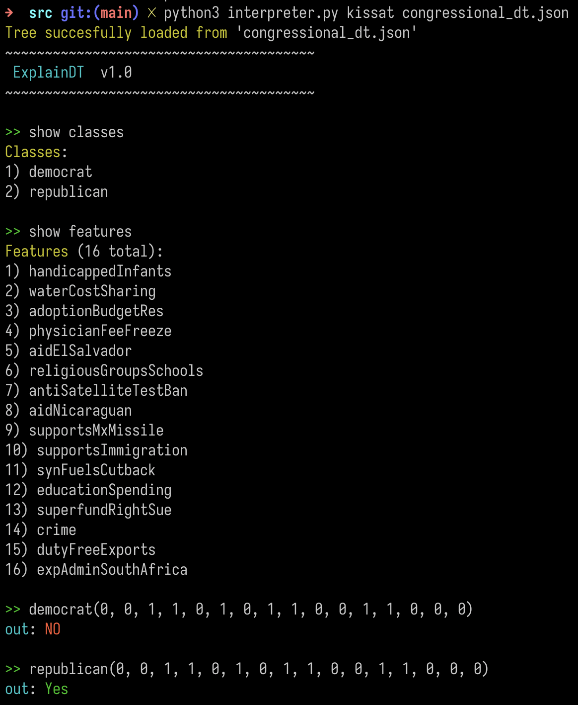
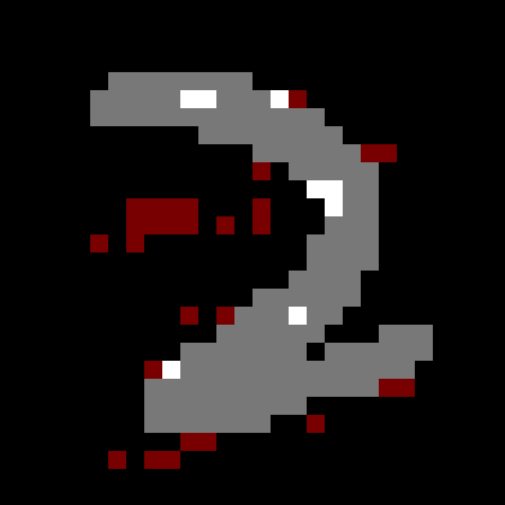
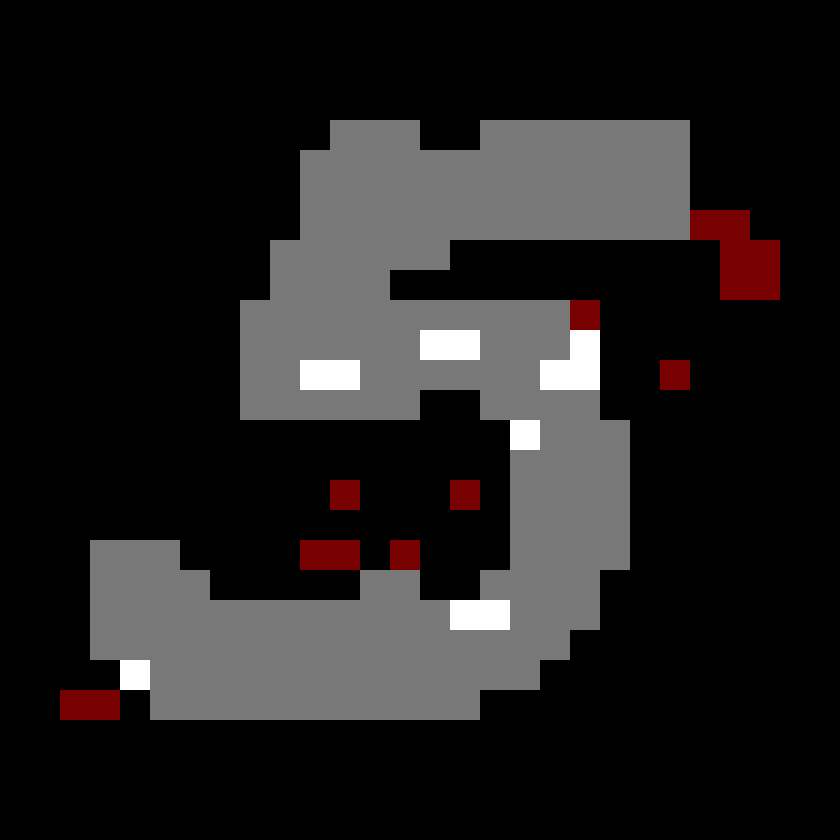
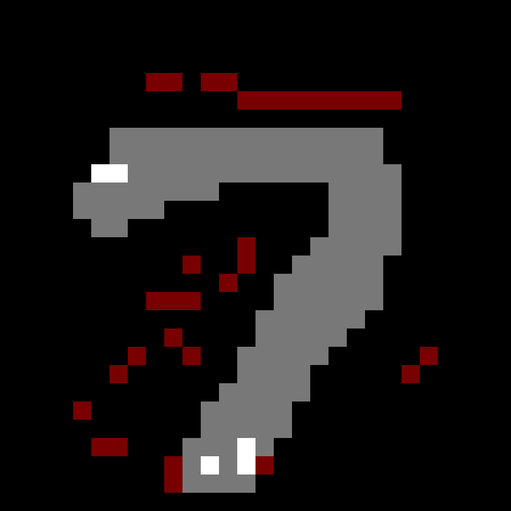

# ExplainDT

Implementation of the work proposed in the submission 'A Symbolic Language for
Interpreting Decision Trees' for NeurIPS 2023.

_ExplainDT_ is a language built on top of the _StratiFOILed_ logic proposed in
our submission. ExplainDT generates CNF formulas in the
[`DIMACS`](http://www.satcompetition.org/2009/format-benchmarks2009.html)
format to be able to solve complex queries over decision trees for both local
and global interpretability, by leveraging the power of SAT solvers and modern
encoding techniques.

## Dependencies

- `python > 3.10`
- `pytest` (for testing)
- `argparse` (tree generation)
- `scikit-learn` (tree generation)
- `python-mnist` (experiment dataset)
- `matplotlib` (experiment plots)
- `seaborn` (exepriment plots)
- `pandas` (experimet result handling)
- `typer` (experiment cli app)

To take care of dependencies run the following command on the project's root
directory:

```
$ pip install -r requirements.txt
```

### SAT solvers

To effectively run _ExplainDT_ one needs a modern CDCL-based SAT solver
installed, such as [kissat](https://github.com/arminbiere/kissat).
Nevertheless, our implementation is flexible enough to allow any solver that
takes formulas in the DIMACS format.

### Operating Systems

This work was developed for unix-like systems (tested in MacOS Ventura 13.1 and Pop!_OS 20.04). While it might work on Windows, or other operating systems, we have not tested it appropriately to guarantee support.

### Organization

The rest of this README document is divided into two parts: 

1. Using the REPL interpreter
2. Reproducing experimental results

## 1. Using the REPL interpreter

The following screenshot depicts an interaction with ExplainDT as a REPL interpreter.



The general command structure is:
```
$ python3 interpreter.py {solver_path} [decision_tree_json_path]
```

Alternatively, if no decision tree is provided when initiating the program, the expression: `load {decision_tree_json_path}` loads the corresponding decision tree.

The appendix (Section A.2) provides more example queries and actions available in the interpreter.


## 2. Reproducing experimental results


### General Experiments

To try out for yourself the experiments included in the submitted work make use
of the included command line application that can be accessed by running the
projects `main.py` file with Python's interpreter.

The general command structure is as follows:

```
$ python3 main.py {experiment_name} {solver_path} {variations} [options]
```
For more information on the available experiments and their supported options
run
```
$ python3 main.py --help
```
```
$ python3 main.py {experiment_name} --help
```
One note worthy option that warrants being mentioned in this section is the
`--gt` option that generates the necessary trees for the experiment in which it
is included.

### k-bottom Experiments

In the experiment suit there are those that attempt to find partial instances
that satisfy formulas of the form `f(x) = Prop(x) ^ LEL(x, z)` where `LEL(x,
z)` is used to ensure that the partial instance `x` has at most `k` undefined
features. For this experiments a mandatory `--param k` flag must be included in
order to specify `k`. Otherwise a default value of `k=0` is used.

### Note
Because queries over some trees can take more time than other for some
parameters a separate experiment for the `RFS` formula was included.
```
$ python3 main.py mnist-rfs --digit {digit} --param {k} [options] 
```
In this experiment the `digit` to use and the `k` param must be specified.
Additionally if the option `--overlay 8` is used a special image comparing
instances of the digit to the `RFS` found will be generated (assuming one
exists). We invite the eager reader to use this command to do a manual binary
search for minimal `RFS` of the digits' trees. Keep in mind that the MNIST
dataset has 784 dimension. Happy hunting!

## Results

The experiment's results, both plots and raw data, are stored in the
`experiments/experiment_results` directory on folders corresponding to the name
of each individual experiment. The following is an example of a few of the
results generated by running the `mnist-vis` experiment with the kissat solver
using the command:
```
$ python3 main.py mnist-vis solvers/solver_execs/kissat kb_sr --param 730 --parallel
```
2 | 5 | 7
:------------------------------------------:|:-------------------------------------------:|:-------------------------------------------:
 |  | 

### Testing
To run unit tests, please ensure that kissat's binary is on the project's
`solvers/solver_execs` directory and run `pytest`.
